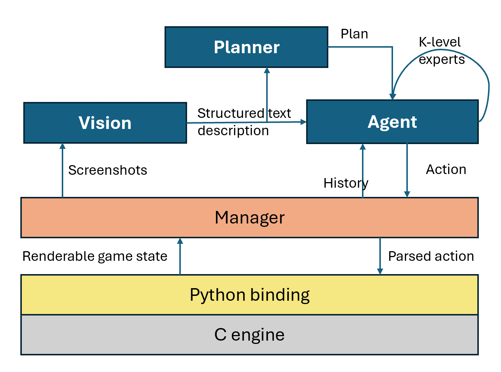

# Will GPT-4 Run DOOM?

This is the repository for the paper "[Will GPT-4 Run DOOM?](https://arxiv.org/abs/2403.05468)". 
We find that GPT-4 is capable of playing the game to an acceptable degree, with more complex call (prompt) schemes yielding better results. 
We also observe, however, that this model's reasoning capabilities around things like object permanence and pathing are not good: the model will forget about objects not immediately in the frame (even though they are encoded in the history), and will frequently shoot walls, get stuck in corners, and walk on acid.

Sample runs are in the [outputs](outputs/README.md) folder. Can you do better? Can your prompts finish the level?

# Requirements
1. You need a `doom.wad` file. These are easy to find since they were open-sourced. The paper used the . Once you've gotten it, place it in the same directory as the notebook.
2. Install [cydoomgeneric](https://github.com/wojciech-graj/cydoomgeneric)
3. Modify the `llmclient.py` class to work with your own LLM client (i.e., Azure OpenAI, regular OpenAI, etc)


# Quickstart
1. Open the notebook and follow the instructions in there for setup.
2. You can modify the following variables (ok, you can modify the entire code, but this is the quickstart):
  - `DO_PLAN`: (call the planner every `PLAN_INTERVAL_FRAMES`)
  - `PLAN_INTERVAL_FRAMES`: to call Planner
  - `KLEVEL_INTERVAL`: (call k-levels every `KLEVEL_INTERVAL` frames). It should be a multiple of `PLAN_INTERVAL_FRAMES`: or else you'll get lots of hallucinations and your code will potato out.
  - `PROMPT_TYPE`: one of `"klevels", "walkthrough", "plan"`, or anything (which will be `"naive"`). I would use `"walkthrough"` since it is more lightweight than plan/k-levels but better performing than naive.
3. You can only end the game by restarting the kernel (seems to be some sort of memory issue).


# Common issues
- _Model getting stuck in corners_: restart, rerun, let it figure it out -- it happens. You'll have more luck with the planner and k-level prompts. 
- _Can't end the game_: You need to restart the kernel. Unfortunately, I don't know of any other way to get it to end gracefully. You can also uncomment the exit conditions from the prompt so that the model exits when it has 0% health. Either way, you have to kill/crash the kernel.
- _Too slow_: Swap the models to Turbo/smaller models. No idea how's that gonna work though. Unfortunately, there's not a lot of things I can do here since... well, it's an intrinsic property of the planning. You _could_ call the planner and k-level experts at larger intervals (`PLAN_INTERVAL`)
- _Not starting/going straight into the demo_: this script has hardcoded the commands to skip the menu selection screen under `SKIP_CODES` (the commands) and `SKIP_FRAME_COUNT` (the frames to execute these comands for). You can tune these to adapt to your hardware. 
- _The model plays weird/walks hugging the walls/can't aim_: seems that the model isn't that great at spatial reasoning (who knew!) and planning (D:). That said the way I see it the model _is_ playing the game, albeit not how a human would. Perhaps we shouldn't expect a mass of statistically inferred integers to behave like a human brain. Either way, the aiming could be fixed with prompt engineering I'd wager. 

# Architecture

The code that you are running in the notebook is a connector to the Matplotlib implementation of Doom by [@wojciech-graj](https://github.com/wojciech-graj/cydoomgeneric), which itself connects itself to the Doom engine. That's probably why it runs at 7 fps, but GPT-4 never did complain about the framerate. 

The core bits are the call schemes (prompts): naive, walkthrough, planner, and k-levels. At every step, Matplotlib sends the rendered picture to a manager (the Python class). This manager sends the screenshot to GPT-4V, and then this output + history + extra call parameters to GPT-4. 

Depending on the prompt/params there might be extra calls to GPT-4 (planner, k-levels, etc).

Here's a diagram of the call stack:




# Citation
If you've found this code or the paper useful in your work, please cite it:
```
@article{DeWynterDOOM,
	title = {Will {GPT}-4 Run {DOOM}?},
	author = {Adrian de Wynter},
    journal = {ArXiv},
    year = {2024},
    volume = {abs/2403.05468},
    url = {https://arxiv.org/abs/2403.05468},
    doi = {https://doi.org/10.48550/arXiv,2403.05468}
}
```


# Licence 

All original code (prompts, step call, planning logic, etc.) written by me is MIT licence, but you may not use it for any military or surveillance applications, or anything that could lead to harm (psychological or physical) to another human being. 
Everything else, including the Matplotlib Python DOOM interface, are GPL-2.0 and property of their respective authors. Doom is an IP by id Software.
